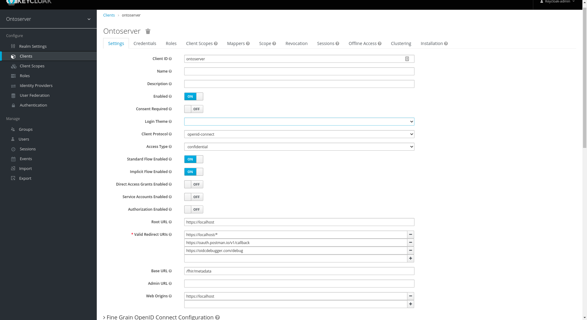
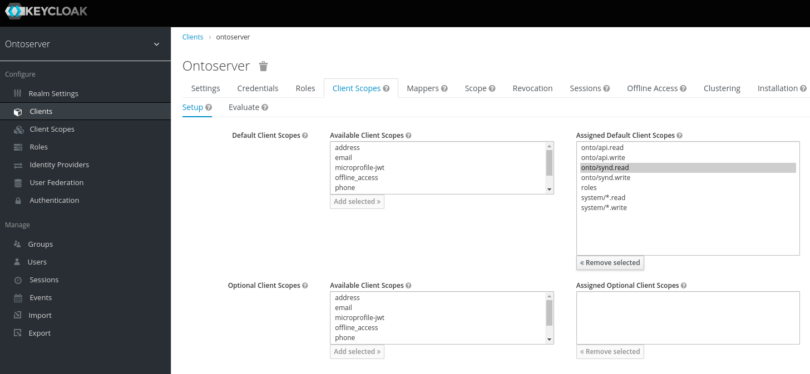
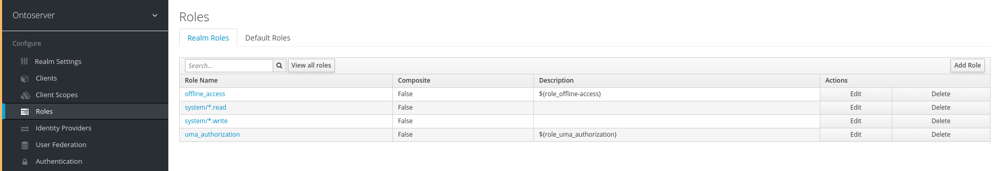
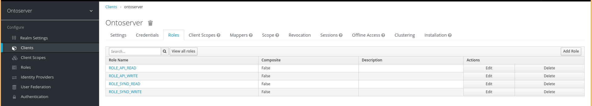
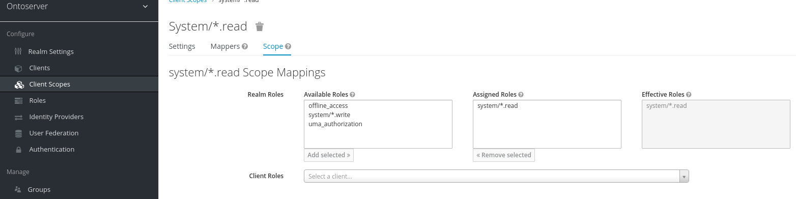
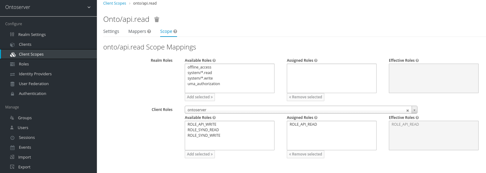
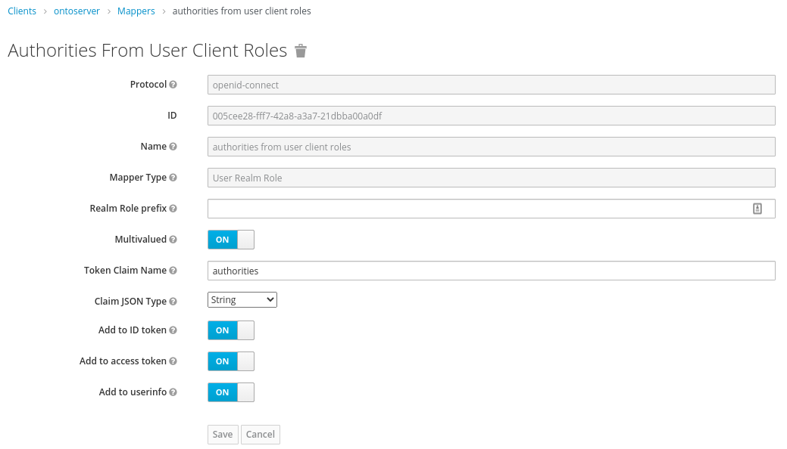
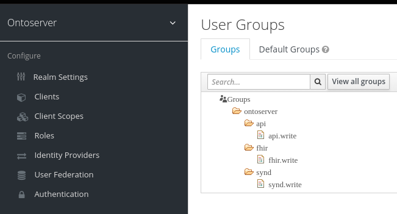
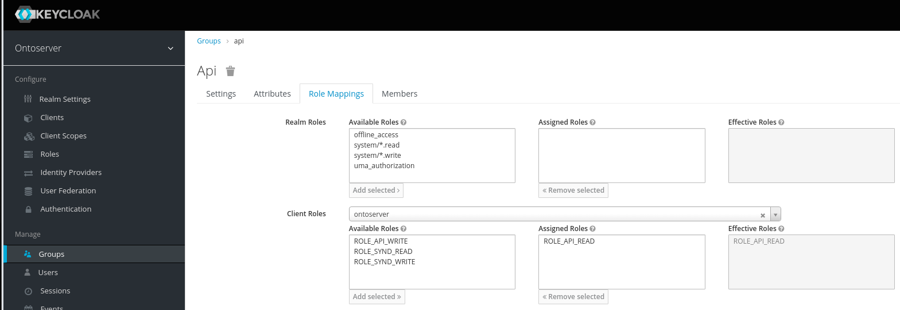
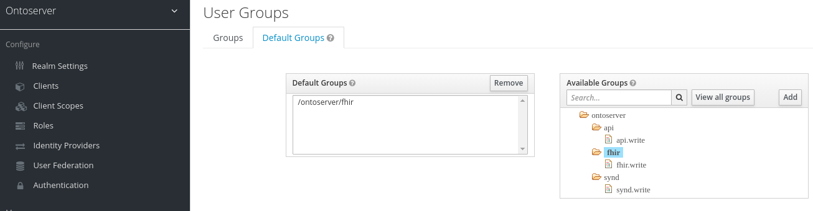

# CSIRO Ontoserver ♥ Keycloak

THIS ARTICLE IS WIP!

## Overview

This project demonstrates how to integrate CSIRO's
[Ontoserver](https://ontoserver.csiro.au), a FHIR-based terminology server, with
Red Hat's [Keycloak](https://keycloak.org), an OpenID Connect-compliant Identity
and Access Management server.

⚠ This article aims give a comprehensive introduction into the required concepts
and detailed instructions on how to configure the different components. Due to
this, paragraphs with actionable instructions are highlighted with "⚠" emoji,
like this one. ⚠

> It is in part quite opinionated, and some opinions or statements may be wrong
> or insecure, due to the author being new to all of this as well ;) If you spot
> issues, please do get in touch via GitHub issues!

Ontoserver relies on
[SMART-on-FHIR Backend Services Authorization](https://hl7.org/fhir/uv/bulkdata/authorization/index.html).
As the authorization/authentication specification for SMART-on-FHIR is derived
from the [OpenID Connect](https://openid.net/connect/) specification, a
"generic" authentication server that supports OAuth2 and OIDC, such as Keycloak,
can be used to authorize requests to Ontoserver.

This projects uses Docker Compose to orchestrate four services working in
tandem:

- `db`: A PostgreSQL database both for Ontoserver and Keycloak. It is not
  exposed on the public interface, but only accessible from the internal
  network.
- `ontoserver`: The Ontoserver instance that is being secured by Keycloak. It
  has security enabled and requires authentication for all API calls using
  SMART-on-FHIR.
- `keycloak`: The Keycloak authentication server and identification provider.
- `nginx`: a reverse proxy that sits in front of `ontoserver` and `keycloak`,
  which also handles TLS termination (very much recommended!)

## Getting Started

Apart from `docker` and `docker-compose` installed on your machine, you will
need a license to use Ontoserver and need to be logged into Docker Hub with your
authorized account. Please
[talk to the Ontoserver team at CSIRO](mailto:ontoserver-support@csiro.au) if
you do not hold a license for Ontoserver.

You will also need a SSL certificate chain and key in PEM format to secure calls
to your containers. The provided nginx SSL configuration assumes a
`ssl_certificate` key containing your server certificate and all required
intermediates, along with a `ssl_certicate_key` containing your private key. It
was generated using
[Mozilla's SSL Config](https://ssl-config.mozilla.org/#server=nginx&version=1.17.7&config=intermediate&openssl=1.1.1d&hsts=false&ocsp=false&guideline=5.6)
tool. For the provided SSL/TLS configuration, you will also need to either
generate or download pre-generated Diffie-Hellman Parameters. See the
`nginx/ssl.conf` for details.

When building the images in this `docker-compose` project, a number of
customizations are carried out. Most importantly, the Keycloak database and
associated user are created in the database.

In the keycloak container, this configuration assumes that two text files
`username.secret` and `password.secret` are present in `/opt/secrets/`. You must
create these files in the `keycloak` directory! They will be used to authorize
the Super-Admin of your Keycloak installation, so **make sure that they a) are
not trivial to guess and b) remain secret!**. They should _NEVER_ be added to
Git, in case you fork this repository, and are excluded using the `.gitignore`.
These files should only contain the username/password, and optionally a trailing
newline.

⚠ Here is a checklist for the initial start-up ⚠

- [ ] docker hub logged-in with an authorised account
- [ ] PKI certificate issued from trusted CA, private key placed at
      `nginx/certs/certificate.key`, public key _with the full certification
      chain_ at `nginx/certs/certificate-chain.pem`
- [ ] `nginx/certs/dhparam` [generated or downloaded](nginx/ssl.conf)
- [ ] username and password for Keycloak created,
      [noted securely](https://keepass.info/), added to
      `keycloak/username.secret` and `keycloak/password.secret`

⚠ After completing the checklist, you can start the suite of containers for the
first time: ⚠

```
docker-compose pull && \
docker-compose build && \
docker-compose up
```

This will take a while. When all containers are created and initialized, you
will be able to access these routes from your machine (substitute `localhost`
with the FQDN of your machine if required):

- Ontoserver on https://localhost/, with
  - the conformance statement on https://localhost/fhir/metadata
  - the Ontoserver [FHIR](https://localhost/fhir/),
    [management API](https://localhost/api/) and
    [syndication](https://localhost/synd/) routes
- The Keycloak landing page on https://localhost/keycloak with
  - the admin console on https://localhost/auth/admin

You will now be able to set up Keycloak to provide the authentication service
required.

## Understanding OpenID Connect

TODO

Flow explanation:
https://www.keycloak.org/docs/latest/server_admin/#_oidc-auth-flows

## Keycloak Configuration

Log-in into the Keycloak Administration console (at https://localhost/auth/admin
if executing this project on a machine with graphical capabilities). The
credentials will be the ones provided in the `{username,password}.secret` files
you created above.

We will need to carry out the following steps:

1. Create a new _Realm_ in which our Ontoserver users reside
2. Add a _Client_ in the newly-created Realm
3. Set-Up _Client Scopes_ in the Realm
4. Create _Roles_ in the Realm and/or Client
5. Set-Up mappers for the Client Scopes and Roles
6. Optionally create groups
7. Create users and assign privileges, and possibly federation

### Realm

A _Realm_ serves as a namespace for users, groups, clients, client scopes and
roles. In a fresh Keycloak installation, only one realm, _Master_ exists. This
realm handles authentication to the management console. Generally, you want to
separate user administration from resource access as much as possible. Thus, you
should add users to the Master realm only if they need to perform management
tasks in Keycloak itself.

⚠ The first step is thus to create a new Realm for securing access to
Ontoserver. When logged-in, the current realm will be shown below the Keycloak
logo in the top-right. When you hover over the "Master" text, a button "Add
realm" will be shown. Click it, then enter a suitable name for the new realm,
like "Ontoserver" or your project name if you will secure further applications
that interact with Ontoserver. ⚠

You may want to configure these settings:

- in the General tab
  - [ ] the Display name that is shown to users when logging
- in the Login tab
  - [ ] whether users can self-register, use the Forgot password functionality,
        etc.
  - [ ] Whether SSL is required for requests
- in the Email tab
  - [ ] server details for an SMTP server if you want users to register/reset
        passwords etc.
- token settings, like the login time-out

### Client Creation

A _client_ in OIDC is a software that users interact with. Users can be granted
privileges within these services, but also control which data from their profile
they want to share with the application. Whenever you see a "Login with {Google,
GitHub, Facebook, Apple, etc.}" button, you are interacting with an OIDC client.

⚠ Within your realm, click on "Clients" in the left-hand pane and then "Create"
in the top-right corner of the table. For the client id, you can chose any
alphanumeric identifier. It is used in the URLs when requesting tokens. By
default, it is also presented to the user if no friendly name is defined in the
"Name" setting. For the Root URL, you will want to enter the FQDN of the system
you are setting up, like https://ontoserver.your.domain.com. Choose Open ID
Connect for the protocol! ⚠

⚠ You will NEED to configure the following settings: ⚠

- [ ] _Access Type_
  - whether a secret is required when exchanging an authorization code for an
    authentication tokens (using the standard flow). This is recommended, as it
    greatly enhances security when you are able to use the standard flow. As
    outlined above, you will be able to use this flow if your client is able to
    "keep a secret" from the user. If your authorization flow happens
    server-side (Node, Java, ASP.NET etc.) this will likely be the case.
    Otherwise, you will need to use the Implicit flow.
- [ ] _Implicit Flow enabled_
  - If you plan on authorising applications that can't keep a secret, like
    JavaScript-based client-side applications, you will need the implicit flow
    enabled.
- [ ] _Direct Access Grants enabled_
  - if you have the credentials of the user available, you can enable this
    setting to exchange this tuple for access tokens. You may want to disable
    this unless specifically needed, since it is the least secure of the three
    flows (it is hard to keep a password secret in your application!) If you
    need to authorize scripts or other server-side applications, use the
    [_Service Accounts enabled_ setting instead](https://www.keycloak.org/docs/latest/server_admin/#_service_accounts)
- [ ] _Root URL_
  - see above, where the service that is being secured is available, e.g.
    https://ontoserver.your.domain.com
- [ ] _Valid Redirect URIs_
  - Especially for _Public_ clients, this is extremely important to configure.
    When requesting tokens, this is the Allow-List for which URLs Keycloak will
    redirect to. They should be
    [as specific as possible](https://www.keycloak.org/docs/latest/server_admin/#_unspecific-redirect-uris),
    however, wildcards are allowed (only at the end, however). If your frontend
    client is at https://ontoserver.your.domain.com/onto_client, you will enter
    something like `/onto-client/oidc_redirect_uri`. You may also want to add
    callbacks for tools like [Postman, ](https://oauth.pstmn.io/v1/callback) or
    [OIDC Debugger](https://oidcdebugger.com/debug)
- [ ] _Base URL_
  - The (probably relative) URL Keycloak should use when redirecting to the
    client, `/fhir/metadata` is a good choice here.
- [ ] _Admin URL_
  - This setting is used when using a Keycloak-specific adapter. Leave it blank.

If you select _confidential_ authorization, you will find the secret required in
the "Credentials" tab.



### Client Scopes

Ontoserver authorizes requests to the FHIR endpoint (as of writing in September
2020 for version 6.0.x, this may change with the upcoming release of 6.1.x)
based on the "scope" claim in the presented access token. Scopes can be shared
across clients within a realm and have to be assigned to clients. This is used
within SMART-on-FHIR, especially when authorizing user-facing applications,
because these scopes can be set to require "Consent". The user will be asked to
grant access to the apps when required, making them able to control access to
their medical data. This is something where SMART-on-FHIR differs from the
"vanilla" OIDC specification, which doesn't use scopes in this way. For
Keycloak, they are mainly a convenient way to add reusable mappers to clients
that map some attribute of the user principal to claims in the generated tokens.

For Ontoserver, and probably many other SMART-on-FHIR-compliant applications, we
will need to make some adjustments to the client scopes already present.

⚠ First-up, we need to add the `system/*.read` and `system/*.write` scopes to
our realm. In the right-hand pane, click "Client Scopes", then "Create" in the
top-right. Add the two scopes, exacly as above, including the slash and
asterisk. If you want, you can also add descriptive texts shown to your users in
case you want to enable consent. The setting _Include in Token Scope_ must be
enabled, and the protocol must be _openid_connect_. ⚠

Contrary to Ontoserver's
[documentation](https://ontoserver.csiro.au/docs/6/config-security.html), the
scopes `onto/{api,synd}.{read,write}` are currently broken. This will likely be
fixed in the upcoming 6.1.x series, in which case this article will be updated
accordingly. Feel free to add the four scopes anyway. You can leave the _Defaut
Client Scopes_ and the already-present as-is. Some of these are mandated by the
OIDC specification and are used by some features of Keycloak (the
self-management console available to users, for example!), so remove them at
your own risk.

⚠ Still, we need to remove some scopes from our Ontoserver client, as the
associated mappers will confuse Ontoserver. Also, we need to make the new scopes
available to the client in the first place. Head over to your client, and select
the "Client Scopes" tab. Remove all _assigned default client scopes_, apart from
`roles` and all _assigned optional client scopes_. Then add the
`system/*.{read,write}` and the `onto/{api,synd}.{read,write}` scopes (if added)
to the default client scopes. ⚠

In this way, the scopes will get added into the `scope` claim of every token
automatically. Optional client scopes will only get added when the
authentication requests includes the desired scopes. Right now, all scopes would
get added for every user. We will make sure that only users in the correct
groups/with the correct roles are allowed to use those scopes in the next steps.
If desired, you could also make some scopes _optional_ if your application is
aware of these scopes and will request them when needed.



### Roles

Since your use case will likely require different levels of authorization, we
will need to set-up some roles that users can assume. These roles will then be
linked to groups (which users belong to, and which can have roles assigned) and
scopes. They are also (currently, as of Ontoserver 6.0.4) required to get right
when securing the `/api` and `/synd` endpoints of Ontoserver.

Roles can be defined at the realm level (and thus used by multiple clients) or
at the client level. The author suggests that the roles for the FHIR endpoint
(which will be linked to `system/*.{read,write}`) are created as realm roles,
while the Ontoserver-specific roles are created on the client level.

⚠ Start by adding roles for the FHIR endpoint by clicking on _Roles_ in the
left-hand pane, then _Add Role_. _You should probably configure one role for
reading and for writing for all three routes—if users always get access to these
routes in tandem, use groups instead of assigning multiple scopes to your
groups_. For the FHIR scopes, the name doesn't technically matter, so using the
name of the respective scope may be a good idea. After adding them, Keycloak
will probably throw a 404 error when trying to display the role settings, and
fail due to the "/\*" in the name. Just go to the home page and select _Roles_
again, the newly created role will be there. ⚠

> Side note: you will always need to keep URL encoding the scopes for the FHIR
> endpoint in mind. Other than the 404 when creating the roles, Keycloak doesn't
> care about the "/\*" as far as I can tell.

⚠ Next, add the client specific roles via Clients -> Ontoserver (or what have
you) -> Roles -> Add Role. You will need to use the following role names:
`ROLE_API_READ, ROLE_API_WRITE, ROLE_SYND_READ, ROLE_SYND_WRITE` as they will be
used for authorization by Ontoserver! ⚠




### Mappers

Mappers determine which user, in which role and in which group, are granted
which claims, and which claims are added into the generated tokens.

First-up, we want to make sure that only authorized users belonging to the right
groups are able to claim scopes. This will change the behaviour of the _Assigned
Default Client Scopes_ you defined above: When you define a _Scope_ mapping for
a _Client Scope_ (the terminology is a bit ambiguous here!), you restrict the
assignment of the scope to users having that role. Whenever a user requests a
token, Keycloak will look at their roles, and the default client scopes, and
issue a token containing all of the default client scopes that the user is
authorised to access, based on their role membership. Without those mappings,
the default client scopes would be added to all tokens, regardless of role
membership!

⚠ Go to _Client Scopes_, and select the `system/*.read` scope. Then select
"Scope" in the tab bar and add the `system/*.read` role to the assigned role.
Repeat this for the `system/*.write` scope.⚠



⚠ If you added the ontoserver-specific clients scopes as well, you will need to
select the respective roles by selecting your client, as the roles are
(hopefully?) defined at the client level ⚠



Next, you will need to add a _Mapper_ to the client. This is to support the
role-based access control (RBAC) that is required for authorizing calls to the
ontoserver-specific routes. **Again, as of 6.0.x, the documentation is currently
_incorrect_. Using scopes of the form `onto/{api,synd}.{read,write}` does not
work and passing the expected roles in the `authorities` claim is required. The
following mapper will accomplish that based on the roles the current user has.**

⚠ Go to your client and select _Mappers_. Click _Create_. Add an arbitrary name,
such as `authorities from user client roles`. Make sure to select _User Client
Role_ as the _Mapper Type_, and select your client id. _Realm Role Prefix_
should be empty, and _Multivalued_ should be on. Enter `authorities` as the
_Token Claim Name_ and `String` as the \_Claim JSON type`. Leave the three
toggles on, so that the claim gets added to all tokens. ⚠



### Groups

You will likely have multiple users that perform similar tasks, such as
administrators, content creators, system users, or general users. To grant those
users the right to access particular resources, you could directly assign them
roles. This is error-prone, because many users assume multiple roles. A better
way is to use _Groups_, which are a collection of roles, for each of the tasks a
user should carry out. The exact configuration you will create will most likely
look different to the one described below.

You can nest groups, which will inherit the role mappings of their parent. For
example, every user that has write access to the syndication API should also
have read access. You can map the read access in the top-level group and create
a group as an child of that read-only group.

⚠ Configure some _Groups_ that fit your requirements. Here is a rather technical
example: ⚠



⚠ Don't forget to configure _Role Mappings_ that map _realm_ and/or _client
roles_ to the group: ⚠



In the example above, the `{api,fhir,synd}` groups have the respective `read`
roles granted, while the nested groups additionally have the respective `write`
roles. Only `ontoserver` has no group mapping.

⚠ You should also configure a default group in which new users are placed. For
the example above, the likely candidate is `ontoserver/fhir` for read-only
access on a locked-down server. This setting is especially important if you a)
allow users to self-register or b) use a federation mechanism like LDAP or an
external identity provider like Google. ⚠



### Users

## Ontoserver Configuration

- [ ] RS256 key
- [ ] conformance.security.enabled
- [ ] conformance.security.readonly.\*
- [ ] conformance.security.kinds
- [ ] conformance.security.{authorize, token}

## Testing the infrastructure
