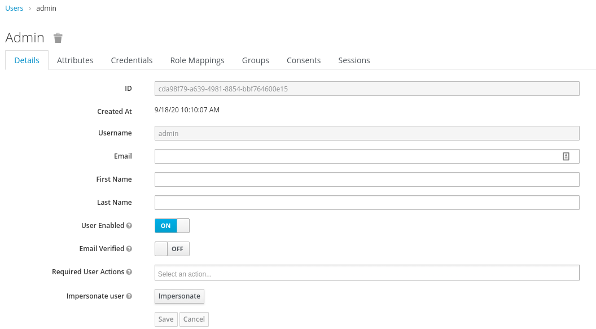
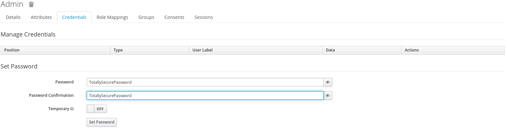
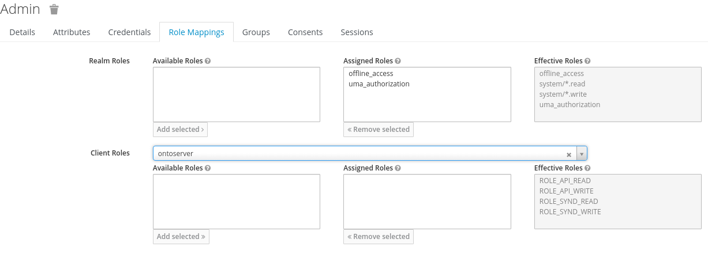
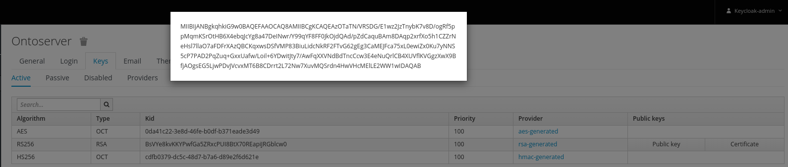
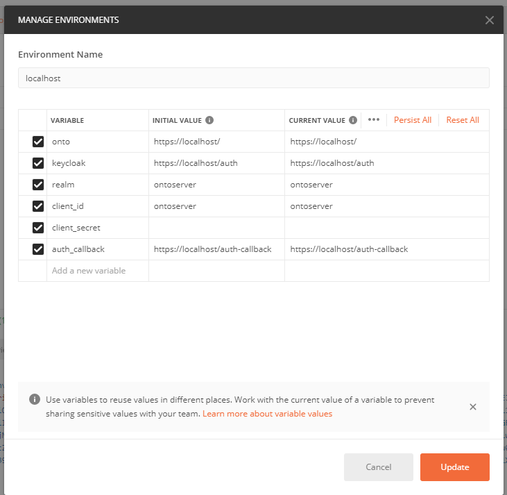
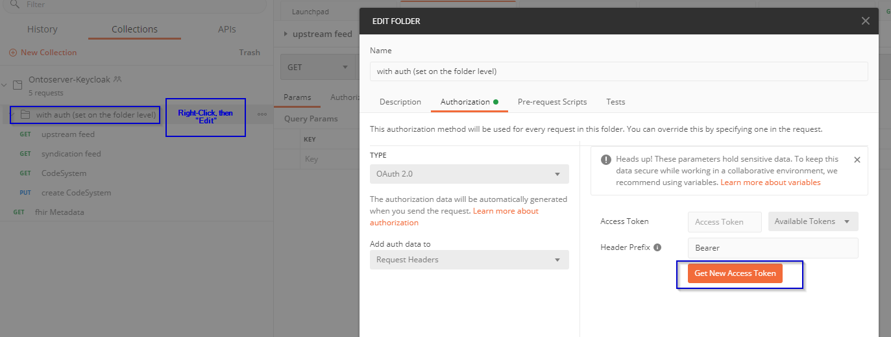
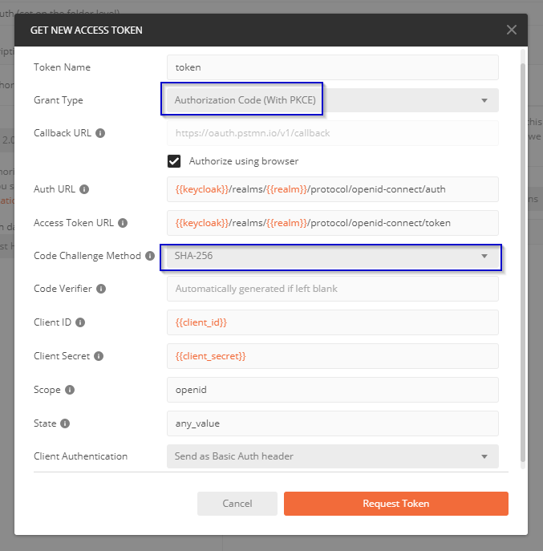
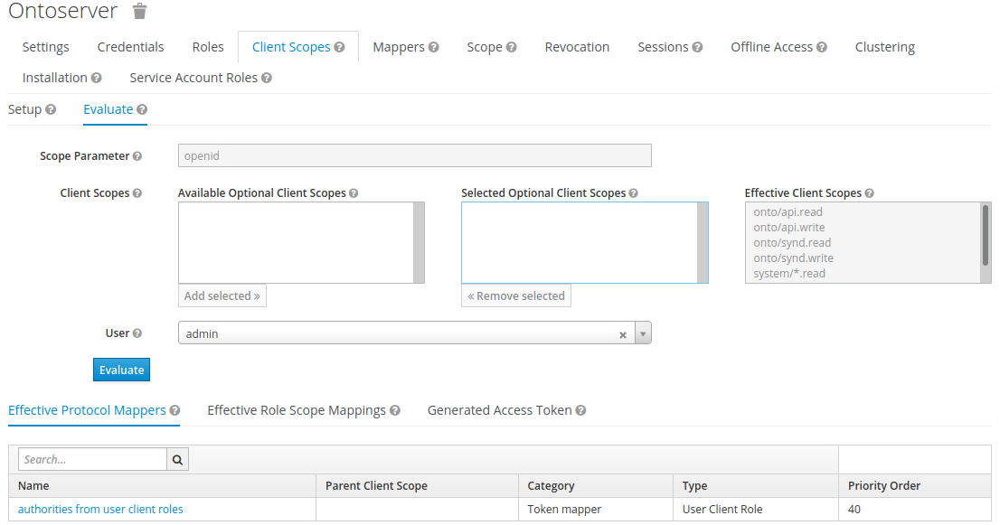
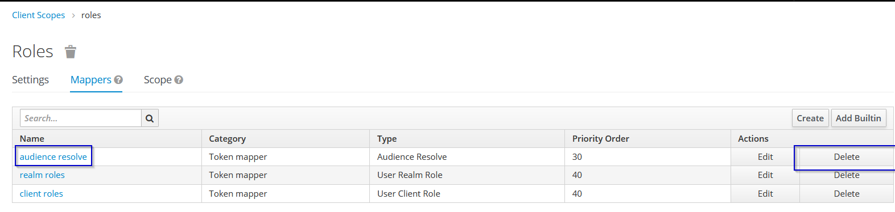
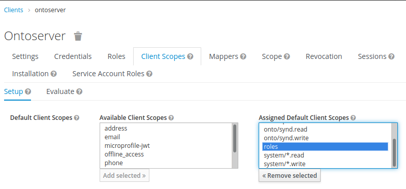

# CSIRO Ontoserver ♥ Keycloak

THIS ARTICLE IS WIP!

## Overview

This project demonstrates how to integrate CSIRO's
[Ontoserver](https://ontoserver.csiro.au), a FHIR-based terminology server, with
Red Hat's [Keycloak](https://keycloak.org), an OpenID Connect-compliant Identity
and Access Management server.

⚠ This article aims give a comprehensive introduction into the required concepts
and detailed instructions on how to configure the different components. Due to
this, paragraphs with actionable instructions are highlighted with "⚠" emoji,
like this one. ⚠

> It is in part quite opinionated, and some opinions or statements may be wrong
> or insecure, due to the author being new to all of this as well ;) If you spot
> issues, please do get in touch via GitHub issues!

Ontoserver relies on
[SMART-on-FHIR Backend Services Authorization](https://hl7.org/fhir/uv/bulkdata/authorization/index.html).
As the authorization/authentication specification for SMART-on-FHIR is derived
from the [OpenID Connect](https://openid.net/connect/) specification, a
"generic" authentication server that supports OAuth2 and OIDC, such as Keycloak,
can be used to authorize requests to Ontoserver.

This projects uses Docker Compose to orchestrate four services working in
tandem:

- `db`: A PostgreSQL database both for Ontoserver and Keycloak. It is not
  exposed on the public interface, but only accessible from the internal
  network.
- `ontoserver`: The Ontoserver instance that is being secured by Keycloak. It
  has security enabled and requires authentication for all API calls using
  SMART-on-FHIR.
- `keycloak`: The Keycloak authentication server and identification provider.
- `nginx`: a reverse proxy that sits in front of `ontoserver` and `keycloak`,
  which also handles TLS termination (very much recommended!)

## Getting Started

Apart from `docker` and `docker-compose` installed on your machine, you will
need a license to use Ontoserver and need to be logged into Docker Hub with your
authorized account. Please
[talk to the Ontoserver team at CSIRO](mailto:ontoserver-support@csiro.au) if
you do not hold a license for Ontoserver.

You will also need a SSL certificate chain and key in PEM format to secure calls
to your containers. The provided nginx SSL configuration assumes a
`ssl_certificate` key containing your server certificate and all required
intermediates, along with a `ssl_certicate_key` containing your private key. It
was generated using
[Mozilla's SSL Config](https://ssl-config.mozilla.org/#server=nginx&version=1.17.7&config=intermediate&openssl=1.1.1d&hsts=false&ocsp=false&guideline=5.6)
tool. For the provided SSL/TLS configuration, you will also need to either
generate or download pre-generated Diffie-Hellman Parameters. See the
`nginx/ssl.conf` for details.

When building the images in this `docker-compose` project, a number of
customizations are carried out. Most importantly, the Keycloak database and
associated user are created in the database.

In the keycloak container, this configuration assumes that two text files
`username.secret` and `password.secret` are present in `/opt/secrets/`. You must
create these files in the `keycloak` directory! They will be used to authorize
the Super-Admin of your Keycloak installation, so **make sure that they a) are
not trivial to guess and b) remain secret!**. They should _NEVER_ be added to
Git, in case you fork this repository, and are excluded using the `.gitignore`.
These files should only contain the username/password, and optionally a trailing
newline.

⚠ Here is a checklist for the initial start-up ⚠

- [ ] docker hub logged-in with an authorised account
- [ ] PKI certificate issued from trusted CA, private key placed at
      `nginx/certs/certificate.key`, public key _with the full certification
      chain_ at `nginx/certs/certificate-chain.pem`
- [ ] `nginx/certs/dhparam` [generated or downloaded](nginx/ssl.conf)
- [ ] username and password for Keycloak created,
      [noted securely](https://keepass.info/), added to
      `keycloak/username.secret` and `keycloak/password.secret`

⚠ After completing the checklist, you can start the suite of containers for the
first time: ⚠

```
docker-compose pull && \
docker-compose build && \
docker-compose up
```

This will take a while. When all containers are created and initialized, you
will be able to access these routes from your machine (substitute `localhost`
with the FQDN of your machine if required):

- Ontoserver on https://localhost/, with
  - the conformance statement on https://localhost/fhir/metadata
  - the Ontoserver [FHIR](https://localhost/fhir/),
    [management API](https://localhost/api/) and
    [syndication](https://localhost/synd/) routes
- The Keycloak landing page on https://localhost/keycloak with
  - the admin console on https://localhost/auth/admin

You will now be able to set up Keycloak to provide the authentication service
required.

## Understanding OpenID Connect & Further Reading

OAuth 2.0 is the protocol that powers authorization across the internet.
Whenever you see a button "Sign-in with Google/Apple/GitHub", you are looking at
OAuth 2.0. It is designed to be user-centric and browser-friendly. It is
specified in [RFC 6749](https://tools.ietf.org/html/rfc6749) and
[RFC 6750](https://tools.ietf.org/html/rfc6750). OpenID Connect is a layer on
top of OAuth which adds _Identity_ (i.e. authentication) to the protocol.

The core of OAuth is naturally an authorization server. This server maps user
identities to access rights and issues verifiable tokens in the JSON Web Token
(JWT) format specified in [RFC 7519](https://tools.ietf.org/html/rfc7519).

While OAuth 2.0 is an authorization service, it does not allow for verifying the
identity of the end user. This is what OpenID Connect addresses. More
information is available at https://openid.net/connect/.

Because OAuth 2.0 and OpenID Connect are robust, secure, and widely-used
protocols, the [SMART-on-FHIR specification](https://docs.smarthealthit.org/),
used for integrating personal healthcare apps with each other. A great
introduction is also available at
https://smilecdr.com/docs/security/smart_on_fhir_introduction.html. Strictly
speaking, the security system of Ontoserver seems to be not entirely compliant
with the SMART-on-FHIR subspecification,
[SMART Backend Services: Authorization Guide](https://hl7.org/fhir/uv/bulkdata/authorization/index.html).
Still, many concepts apply.

> The SMART-on-FHIR specifications calls for callers of backend services
> dynamically register with the authorization server and present a signed access
> token when requesting authorization codes. This is not supported by
> Ontoserver.

Regardless, the current security model of Ontoserver requires that requests to
secure endpoints present a valid Bearer token in JWT format, issued and
cryptographically signed by a trusted authorization server, to grant access.

Because OpenID Connect is a modern protocol, the tokens are obtained using HTTP
GET and POST operations. The specification supports multiple _flows_ that define
how such a token can be obtained. The issued tokens will contain _claims_ that
are interpreted by the receiving server to grant or deny access to resources.

The primary means that clients should support is the _Direct_ flow,
[specified here](https://openid.net/specs/openid-connect-core-1_0.html#CodeFlowAuth).
This flow relies on an short-lived _authorization code_ that is issued by the
authorization server upon a GET request to the authorization endpoint of the
authorization server. The request for the authorization code is validated by the
authorization server, and the end-user is authenticated. If allowed, the
authorization server will perform a `302 Found` redirection to the specified
callback URL, with a parameter for the authorization code. This authorization
code can then be exchanged for the authorization token using a POST request.
This is done so that the authorization tokens are transmitted only in the HTTP
body, not in the header or URL fragments. When exchanging codes for tokens, the
client presents a credential that authenticates the client to the authorization
server, along with the code. This flow is illustrated in the following image.


Because it is not possible to store a credential in some clients (such as modern
Single-Page Applications that don't have a backend service), the flow as
described above is not practical for such clients. Historically, the
[Implicit flow was used instead](https://openid.net/specs/openid-connect-core-1_0.html#ImplicitFlowAuth),
but this flow is not recommended any more because it
**[will leak tokens in URL fragments](https://tools.ietf.org/html/draft-ietf-oauth-security-topics-15#section-2.1.2)**,
which are visible in the browser history and can be extracted by malicious
browser extensions. Hence,
**[you should NOT use this flow](https://developer.okta.com/blog/2019/08/22/okta-authjs-pkce)**.

Instead, use the standard flow with the PKCE extension, specified in
[RFC 7636](https://tools.ietf.org/html/rfc7636).

<!-- TODO continue here -->

## Keycloak Configuration

Log-in into the Keycloak Administration console (at https://localhost/auth/admin
if executing this project on a machine with graphical capabilities). The
credentials will be the ones provided in the `{username,password}.secret` files
you created above.

We will need to carry out the following steps:

1. Create a new _Realm_ in which our Ontoserver users reside
2. Add a _Client_ in the newly-created Realm
3. Set-Up _Client Scopes_ in the Realm
4. Create _Roles_ in the Realm and/or Client
5. Set-Up mappers for the Client Scopes and Roles
6. Optionally create groups
7. Create users and assign privileges, and possibly federation

### Realm

A _Realm_ serves as a namespace for users, groups, clients, client scopes and
roles. In a fresh Keycloak installation, only one realm, _Master_ exists. This
realm handles authentication to the management console. Generally, you want to
separate user administration from resource access as much as possible. Thus, you
should add users to the Master realm only if they need to perform management
tasks in Keycloak itself.

⚠ The first step is thus to create a new Realm for securing access to
Ontoserver. When logged-in, the current realm will be shown below the Keycloak
logo in the top-right. When you hover over the "Master" text, a button "Add
realm" will be shown. Click it, then enter a suitable name for the new realm,
like "Ontoserver" or your project name if you will secure further applications
that interact with Ontoserver. ⚠

You may want to configure these settings:

- in the General tab
  - [ ] the Display name that is shown to users when logging in
  - [ ] the frontend-url that is used when generating URLs that link back to
        Keycloak, for example in the `.well-known` endpoint configuration. Set
        this to `https://<your fqdn>/auth` to override the auto-detected value
        and check whether this is correct using the _OpenID Endpoint
        Configuration button_ below.
- in the Login tab
  - [ ] whether users can self-register, use the Forgot password functionality,
        etc.
  - [ ] Whether SSL is required for requests
- in the Email tab
  - [ ] server details for an SMTP server if you want users to register/reset
        passwords etc.
- token settings, like the login time-out

### Client Creation

A _client_ in OIDC is a software that users interact with. Users can be granted
privileges within these services, but also control which data from their profile
they want to share with the application. Whenever you see a "Login with {Google,
GitHub, Facebook, Apple, etc.}" button, you are interacting with an OIDC client.

⚠ Within your realm, click on "Clients" in the left-hand pane and then "Create"
in the top-right corner of the table. For the client id, you can chose any
alphanumeric identifier. It is used in the URLs when requesting tokens. By
default, it is also presented to the user if no friendly name is defined in the
"Name" setting. For the Root URL, you will want to enter the FQDN of the system
you are setting up, like https://ontoserver.your.domain.com. Choose Open ID
Connect for the protocol! ⚠

⚠ You will NEED to configure the following settings: ⚠

- [ ] _Access Type_
  - whether a secret is required when exchanging an authorization code for an
    authentication tokens (using the standard flow). This is recommended, as it
    greatly enhances security when you are able to use the standard flow. As
    outlined above, you will be able to use this flow if your client is able to
    "keep a secret" from the user. If your authorization flow happens
    server-side (Node, Java, ASP.NET etc.) this will likely be the case.
    Otherwise, you will need to either use the Implicit flow
    [(not recommended!)](https://tools.ietf.org/html/draft-ietf-oauth-security-topics-15#section-2.1.2)
    or support the standard flow with PKCE enabled in your client!.
- [ ] _Implicit Flow enabled_
  - If you plan on authorising applications that can't keep a secret, like
    JavaScript-based client-side applications, you may need the implicit flow
    enabled. This flow is
    [not recommended due to security concerns!](https://tools.ietf.org/html/draft-ietf-oauth-security-topics-15#section-2.1.2).
    You should instead use the Standard flow with _Proof Key for Code Exchange_.
- [ ] _Direct Access Grants enabled_
  - if you have the credentials of the user available (i.e. you feature a log-in
    form directly in your application, or you reuse credentials across clients,
    BAD!), you can enable this setting to exchange this tuple for access tokens.
    This flow corresponds to the "Resource Owner Password Credentials" flow in
    the OAuth 2.0 specification. You MUST disable this unless specifically
    needed, since the
    [OAuth 2.0 specification](https://tools.ietf.org/html/rfc6749#section-1.3.3)
    states that "_the credentials should only be used when there is a high
    degree of trust between the resource owner and the client (e.g., the client
    is part of the device operating system or a highly privileged application),
    and when other authorization grant types are not available (such as an
    authorization code)_". If you need to authorize scripts or other server-side
    applications, use the
    [_Service Accounts enabled_ setting instead](https://www.keycloak.org/docs/latest/server_admin/#_service_accounts)
- [ ] _Root URL_
  - see above, where the service that is being secured is available, e.g.
    https://ontoserver.your.domain.com
- [ ] _Valid Redirect URIs_
  - Especially for _Public_ clients, this is extremely important to configure.
    When requesting tokens, this is the Allow-List for which URLs Keycloak will
    redirect to. They should be
    [as specific as possible](https://www.keycloak.org/docs/latest/server_admin/#_unspecific-redirect-uris),
    however, wildcards are allowed (only at the end, however). If your frontend
    client is at https://ontoserver.your.domain.com/onto_client, you will enter
    something like `/onto-client/oidc_redirect_uri`. You may also want to add
    callbacks (temporarily) for tools like Postman
    (https://oauth.pstmn.io/v1/callback) or OIDC Debugger
    (https://oidcdebugger.com/debug)
- [ ] _Base URL_
  - The (probably relative) URL Keycloak should use when redirecting to the
    client, `/fhir/metadata` is a good choice here.
- [ ] _Admin URL_
  - This setting is used when using a Keycloak-specific adapter. Leave it blank.
- [ ] _Advanced Settings_ -> _Proof Key for Code Exchange Code Challenge Method_
  - use the S256 challenge method for PKCE.

If you select _confidential_ authorization, you will find the secret required in
the "Credentials" tab.


### Client Scopes

Ontoserver authorizes requests to the FHIR endpoint (as of writing in September
2020 for version 6.0.x, this may change with the upcoming release of 6.1.x)
based on the "scope" claim in the presented access token. Scopes can be shared
across clients within a realm and have to be assigned to clients. This is used
within SMART-on-FHIR, especially when authorizing user-facing applications,
because these scopes can be set to require "Consent". The user will be asked to
grant access to the apps when required, making them able to control access to
their medical data. This is something where SMART-on-FHIR differs from the
"vanilla" OIDC specification, which doesn't use scopes in this way. For
Keycloak, they are mainly a convenient way to add reusable mappers to clients
that map some attribute of the user principal to claims in the generated tokens.

For Ontoserver, and probably many other SMART-on-FHIR-compliant applications, we
will need to make some adjustments to the client scopes already present.

⚠ First-up, we need to add the `system/*.read` and `system/*.write` scopes to
our realm. In the right-hand pane, click "Client Scopes", then "Create" in the
top-right. Add the two scopes, exacly as above, including the slash and
asterisk. If you want, you can also add descriptive texts shown to your users in
case you want to enable consent. The setting _Include in Token Scope_ must be
enabled, and the protocol must be _openid_connect_. ⚠

Contrary to Ontoserver's
[documentation](https://ontoserver.csiro.au/docs/6/config-security.html), the
scopes `onto/{api,synd}.{read,write}` are currently broken. This will likely be
fixed in the upcoming 6.1.x series, in which case this article will be updated
accordingly. Feel free to add the four scopes anyway. You can leave the _Default
Client Scopes_ and the already-present scopes as-is. Some of these are mandated
by the OIDC specification and are used by some features of Keycloak within your
Realm (the self-management console available to users, for example!), so remove
them at your own risk.

⚠ Still, we need to remove some scopes from our Ontoserver client, as the
associated mappers will confuse Ontoserver. Also, we need to make the new scopes
available to the client in the first place. Head over to your client, and select
the "Client Scopes" tab. Remove all _assigned default client scopes_ and all
_assigned optional client scopes_. Then add the `system/*.{read,write}` and the
`onto/{api,synd}.{read,write}` scopes (if added) to the default client scopes. ⚠

In this way, the scopes will get added into the `scope` claim of every token
automatically. Optional client scopes will only get added when the
authentication requests includes the desired scopes. Right now, all scopes would
get added for every user. We will make sure that only users in the correct
groups/with the correct roles are allowed to use those scopes in the next steps.
If desired, you could also make some scopes _optional_ if your application is
aware of these scopes and will request them when needed.


### Roles

Since your use case will likely require different levels of authorization, we
will need to set-up some roles that users can assume. These roles will then be
linked to groups (which users belong to, and which can have roles assigned) and
scopes. They are also (currently, as of Ontoserver 6.0.4) required to get right
when securing the `/api` and `/synd` endpoints of Ontoserver.

Roles can be defined at the realm level (and thus used by multiple clients) or
at the client level. The author suggests that the roles for the FHIR endpoint
(which will be linked to `system/*.{read,write}`) are created as realm roles,
while the Ontoserver-specific roles are created on the client level.

⚠ Start by adding roles for the FHIR endpoint by clicking on _Roles_ in the
left-hand pane, then _Add Role_. _You should probably configure one role for
reading and for writing for all three routes—if users always get access to these
routes in tandem, use groups instead of assigning multiple scopes to your
groups_. For the FHIR scopes, the name doesn't technically matter, so using the
name of the respective scope may be a good idea. After adding them, Keycloak
will probably throw a 404 error when trying to display the role settings, and
fail due to the "/\*" in the name. Just go to the home page and select _Roles_
again, the newly created role will be there. ⚠

> Side note: you will always need to keep URL encoding the scopes for the FHIR
> endpoint in mind. Other than the 404 when creating the roles, Keycloak doesn't
> care about the "/\*" as far as I can tell.

⚠ Next, add the **client specific roles** via Clients -> Ontoserver (or what
have you) -> Roles -> Add Role. You will need to use the following role names:
`ROLE_API_READ, ROLE_API_WRITE, ROLE_SYND_READ, ROLE_SYND_WRITE` as they will be
used for authorization by Ontoserver! ⚠


### Mappers

Mappers determine which user, in which role and in which group, are granted
which claims, and which claims are added into the generated tokens.

First-up, we want to make sure that only authorized users belonging to the right
groups are able to claim scopes. This will change the behaviour of the _Assigned
Default Client Scopes_ you defined above: When you define a _Scope_ mapping for
a _Client Scope_ (the terminology is a bit ambiguous here!), you restrict the
assignment of the scope to users having that role. Whenever a user requests a
token, Keycloak will look at their roles, and the default client scopes, and
issue a token containing all of the default client scopes that the user is
authorised to access, based on their role membership. Without those mappings,
the default client scopes would be added to all tokens, regardless of role
membership!

⚠ Go to _Client Scopes_, and select the `system/*.read` scope. Then select
"Scope" in the tab bar and add the `system/*.read` role to the assigned role.
Repeat this for the `system/*.write` scope.⚠


⚠ If you added the ontoserver-specific clients scopes as well, you will need to
select the respective roles by selecting your client, as the roles are
(hopefully?) defined at the client level ⚠


Next, you will need to add a _Mapper_ to the client. This is to support the
role-based access control (RBAC) that is required for authorizing calls to the
ontoserver-specific routes. **Again, as of 6.0.x, the documentation is currently
_incorrect_. Using scopes of the form `onto/{api,synd}.{read,write}` does not
work and passing the expected roles in the `authorities` claim is required. The
following mapper will accomplish that based on the roles the current user has.**

⚠ Go to your client and select _Mappers_. Click _Create_. Add an arbitrary name,
such as `authorities from user client roles`. Make sure to select _User Client
Role_ as the _Mapper Type_, and select your client id. _Realm Role Prefix_
should be empty, and _Multivalued_ should be on. Enter `authorities` as the
_Token Claim Name_ and `String` as the \_Claim JSON type` (not JSON!). Leave the
three toggles on, so that the claim gets added to all tokens. ⚠


### Groups

You will likely have multiple users that perform similar tasks, such as
administrators, content creators, system users, or general users. To grant those
users the right to access particular resources, you could directly assign them
roles. This is error-prone, because many users assume multiple roles. A better
way is to use _Groups_, which are a collection of roles, for each of the tasks a
user should carry out. The exact configuration you will create will most likely
look different to the one described below.

You can nest groups, which will inherit the role mappings of their parent. For
example, every user that has write access to the syndication API should also
have read access. You can map the read access in the top-level group and create
a group as an child of that read-only group.

⚠ Configure some _Groups_ that fit your requirements. Here is a rather technical
example: ⚠


⚠ Don't forget to configure _Role Mappings_ that map _realm_ and/or _client
roles_ to the group: ⚠


In the example above, the `{api,fhir,synd}` groups have the respective `read`
roles granted, while the nested groups additionally have the respective `write`
roles. Only `ontoserver` has no group mapping.

⚠ You should also configure at least one default group in which new users are
placed. For the example above, the likely candidate is `ontoserver/fhir` for
read-only access on a locked-down server. This setting is especially important
if you a) allow users to self-register or b) use a federation mechanism like
LDAP or an external identity provider like Google, GitHub and the like. ⚠


### Users

Next-up, you will need some users in your new installation (if you don't plan on
setting up an external IDP or LDAP/Kerberos federation). Since we added a
default group, every user will at least have some access to Ontoserver.

By default, Keycloak doesn't show any users on the _Users_ page, even if there
are some configured. This is
[by design](https://www.keycloak.org/docs/latest/server_admin/#user-management)!
You can either search for users or click the _View all users_ next to the search
box (this will list all users in your LDAP if configured).

⚠ Create some users for your realm. The only required parameter when manually
creating users is the username. If required, add some
[_Required User Actions_](https://www.keycloak.org/docs/latest/server_admin/#required-actions)
the user will have to perform when logging in the next time. You can also set a
password yourself in the _Credentials_ tab. If you enable _Temporary_, it needs
to be changed when the user next logs-in! You will also need to configure access
to some groups. ⚠





You can evaluate which roles a user has on the _Role Mappings_ page. This will
show all realm- and client-level roles (for one selected client):



This concludes the required steps for configuring Keycloak for use with
Ontoserver. Next up, you may configure some further options for Keycloak, before
setting up Ontoserver itself.

### Optional further steps

You may want to set-up federation of users with LDAP or Kerberos or the option
to register with external identity providers like Google, GitHub, or any other
OAuth2- or SAML-compatible solution. Refer to Keycloak's documentation
[on federation](https://www.keycloak.org/docs/latest/server_admin/index.html#_user-storage-federation)
and
[identity brokering](https://www.keycloak.org/docs/latest/server_admin/index.html#_identity_broker)
for further details on how to do this.

You may also need to configure further users in your Master realm that have
access to the administration console, as documented
[here](https://www.keycloak.org/docs/latest/server_admin/index.html#_admin_permissions).

For especially sensitive applications, you can also require Two-Factor
Authentication (2FA), password policies or WebAuthn hardware-based 2FA, see
[the docs for this](https://www.keycloak.org/docs/latest/server_admin/#authentication).

### Pre-fabricated Realm

The realm that was created during the writing of this guide was exported and
[made available in this repository](ontoserver-realm-export.json). You can
import this realm when clicking the "New realm" button. This will set-up a realm
`Ontoserver` featuring the roles, client scopes, clients, groups and mappings
shown in the screen-shots. The realm was exported on 2020-09-18 and will be kept
up-to-date along with the guide.

## Ontoserver Configuration

After configuring the realm, we will need to make sure that Ontoserver is
configured in the configuration we require and trusts the tokens produced by
Keycloak.

Open the `docker-compose.yml` file in your copy of this repository in your
favourite text editor.

You will need to change several settings in the `environment` section of the
`ontoserver` service.

⚠ First, set the `conformance.fhir.base` to the public URL of your installation.
This path should be reachable/resolvable from the server itself! ⚠

⚠ Next, you will need to decide which routes should be available read-only
without authentication. This is determined by
`ontoserver.security.readOnly.{api,fhir,synd}`. In the provided configuration,
all three routes are locked-down and only `fhir/metadata` can be accessed
without authorization. ⚠

You can also adjust the `conformance.security.description` to explain (to
humans) how the security of your installation works.

⚠ You will need to adjust the URL of the authorization and token services to
your installation, these are the `conformance.security.{authorize,token}`
settings. They will be of the form
`https://<your FQDN>/auth/realms/<your realm name>/protocol/openid-connect/{authorize,token}`.
You can view the correct settings in the "OpenID Endpoint Configuration" JSON
document in the _Realm Settings_ section. ⚠

⚠ One of the most important settings to get right is the
`ontoserver.security.token.secret` configuration. This is used to verify the
signatures of the JSON Web Tokens presented to Ontoserver when making
authenticated calls. If it is not set correctly, the token will be rejected! To
configure this, go to the _Realm Settings_, select the _Keys_ tab, and click the
_Public Key_ button in the RS256 row. Copy the entire string to the clipboard
and paste it over the pre-defined key. Keep the markers intact! ⚠



The setting should look like this, with leading and trailing markers. Every
marker has 5 leading and trailing dashes. You can include newlines before/after
the markers. Whitespace is ignored (outside of the key itself, at least), so you
can use auto-formatting features in your text editor safely without messing up
the setting:

```
- ontoserver.security.token.secret=-----BEGIN PUBLIC KEY-----
MIIBIjANBgkqhkiG9w0BAQEFAAOCAQ8AMIIBCgKCAQEApeS3BVDSzwmrKZqcQoTR8bZoaTcyFovmgDsRYclvbnJ10Jw7gM6epUenDyXuW3x0EZjkvA12SsvcPp1mLnY1qaLMb/4gLAWUgbjUif9wcWzQHe4SqzWMKHZAalszGkB9x045kYdFfLdVMAh1UQsB9CZFUEeKtR4GD85bllZQAG/NsDlCjNH119RS+qQUwB2eQiVcVDgkVCovbzB8olbdFw11s8/I1r/ZGGvEhxthHfqvX1o7JbXfqHu7lgQu+FE9f820ySXBQwJOnDR4MOsGJl2eT8t2cH4aqUxH/qO/a9oMl/3eu0ezkUq+L5cgYRJ4frvDlVoIZ4284aJSAPwdpwIDAQAB
-----END PUBLIC KEY-----
```

> Note that the [docs](https://ontoserver.csiro.au/docs/6/config-security.html)
> state the following regarding the secret: _When configuring Ontoserver to work
> with an authorization server, this parameter should be the shared key (using
> HS256 shared secret/symmetric key). Since version 5.5 of Ontoserver, an
> asymmetric (RS256 public-private) key is supported, although not recommended
> due to potential performance degradation_. As far as I am aware, it is not
> possible to define a HS256 key for token signing, and in
> [fact only really supports RSA-based (asymmetric) key signing](https://lists.jboss.org/pipermail/keycloak-user/2017-May/010809.html),
> where a Red Hed employee states that HMAC-based signing would be a potential
> vulnerability if the shared symmetric key is leaked to an attacker. In such a
> scenario, the attacker could generate their own valid tokens, bypassing the
> Keycloak server entirely!

## Testing the infrastructure

With everything in place, you can restart your ensemble of servers.

[](https://app.getpostman.com/run-collection/d38ff2a2c4bfbebf5f4f#?env%5Blocalhost%5D=W3sia2V5Ijoib250byIsInZhbHVlIjoiaHR0cHM6Ly9sb2NhbGhvc3QvIiwiZW5hYmxlZCI6dHJ1ZX0seyJrZXkiOiJrZXljbG9hayIsInZhbHVlIjoiaHR0cHM6Ly9sb2NhbGhvc3QvYXV0aCIsImVuYWJsZWQiOnRydWV9LHsia2V5IjoicmVhbG0iLCJ2YWx1ZSI6Im9udG9zZXJ2ZXIiLCJlbmFibGVkIjp0cnVlfSx7ImtleSI6ImNsaWVudF9pZCIsInZhbHVlIjoib250b3NlcnZlciIsImVuYWJsZWQiOnRydWV9LHsia2V5IjoiY2xpZW50X3NlY3JldCIsInZhbHVlIjoiIiwiZW5hYmxlZCI6dHJ1ZX0seyJrZXkiOiJhdXRoX2NhbGxiYWNrIiwidmFsdWUiOiJodHRwczovL2xvY2FsaG9zdC9hdXRoLWNhbGxiYWNrIiwiZW5hYmxlZCI6dHJ1ZX0seyJrZXkiOiJ0b2tlbiIsInZhbHVlIjoiIiwiZW5hYmxlZCI6dHJ1ZX1d)
You can test authentication using [Postman](https://getpostman.io) with this
collection.

The Postman [collection](Ontoserver-Keycloak.postman_collection.json) and
[environment](localhost.postman_environment.json) is also provided in this repo.

If required, change the included _environment_ to suit your needs:



You can use the `fhir Metadata` request to view the metadata, which is possible
in all configurations. You should now request a token:




Weirdly, it is not possible to pass a `nonce` (number only used once) for
implicit requests. For the OpenID Connect's implicit flow, this parameter is
required
[as per the specification](https://openid.net/specs/openid-connect-implicit-1_0.html#RequestParameters),
so that Keycloak rejects the request. Since
[this flow is not recommended anyway](https://tools.ietf.org/html/draft-ietf-oauth-security-topics-15#section-2.1.2)
([yes, really don't use it anymore](https://developer.okta.com/blog/2019/08/22/okta-authjs-pkce))
and the standard flow with PKCE enabled
[should be used instead](https://tools.ietf.org/html/draft-ietf-oauth-browser-based-apps-06#section-9.8)
to make sure that authorization tokens are not leaked in redirection URLs, this
should not matter too much.

## Troubleshooting

### General

A number of tools exist that make debugging authentication with OAuth/OIDC
easier.

You can inspect the content of JSON Web Tokens on https://jwt.io. If you add the
RS256 public key in the respective field (including the leading and trailing
markers), it will also verify the signature for you.

Another fantastic tool is https://oidcdebugger.com. This tool can request
authorization codes for you, and can also make requests using the implicit flow.
You will need to (temporarily) add the redirect URL to the allowed redirect URLs
of your client.

To check which mappers add claims to your tokens and which realm/client roles a
certain user has, you can use the "Evaluate" tab under the "Client Scopes" tab
of your client:



### audience claim

If you get the following error, the access token includes an _audience_ (_aud_)
claim that Ontoserver does not accept.

```
{
    "error": "access_denied",
    "error_description": "Invalid token does not contain resource id (oauth2-resource)"
}
```

If you take a look at the access token using a JSON Web Token inspection took,
[for example using this token](https://jwt.io/#debugger-io?token=eyJhbGciOiJSUzI1NiIsInR5cCIgOiAiSldUIiwia2lkIiA6ICI0RHl3WkNUTkM1STN4RDNVN2Q3c21QcU4tdk5SR290bVA2aXd5b0w5Qzg0In0.eyJleHAiOjE2MDA2NzUwNzQsImlhdCI6MTYwMDY3NDE3NCwiYXV0aF90aW1lIjoxNjAwNjc0MTc0LCJqdGkiOiI2NzJiYWI1ZS1mYzhhLTQzMzEtYjg4Ni1jNTNmNzQ3NzQxNDEiLCJpc3MiOiJodHRwczovL2F0aGVuYS5sb2NhbC9hdXRoL3JlYWxtcy9vbnRvc2VydmVyIiwiYXVkIjoiYWNjb3VudCIsInN1YiI6IjNjYjcxMmE3LWYxZGQtNDk3Ny05ZThhLWQyMGQxNDFjOThmNCIsInR5cCI6IkJlYXJlciIsImF6cCI6Im9udG9zZXJ2ZXIiLCJub25jZSI6Imk0eWVjaXMzdWhiIiwic2Vzc2lvbl9zdGF0ZSI6ImY2YTI1OTA3LTk1NzUtNDM0Zi05M2U3LTZkOWFlMjhjMjczOSIsImFjciI6IjEiLCJyZWFsbV9hY2Nlc3MiOnsicm9sZXMiOlsic3lzdGVtLyoud3JpdGUiLCJvZmZsaW5lX2FjY2VzcyIsInVtYV9hdXRob3JpemF0aW9uIiwic3lzdGVtLyoucmVhZCJdfSwicmVzb3VyY2VfYWNjZXNzIjp7Im9udG9zZXJ2ZXIiOnsicm9sZXMiOlsiUk9MRV9BUElfUkVBRCIsIlJPTEVfU1lORF9SRUFEIiwiUk9MRV9BUElfV1JJVEUiLCJST0xFX1NZTkRfV1JJVEUiXX0sImFjY291bnQiOnsicm9sZXMiOlsibWFuYWdlLWFjY291bnQiLCJtYW5hZ2UtYWNjb3VudC1saW5rcyIsInZpZXctcHJvZmlsZSJdfX0sInNjb3BlIjoib3BlbmlkIFNDT1BFX29udG8vc3luZC53cml0ZSBzeXN0ZW0vKi53cml0ZSBzeXN0ZW0vKi5yZWFkIFNDT1BFX29udG8vc3luZC5yZWFkIFNDT1BFX29udG8vYXBpLndyaXRlIFNDT1BFX29udG8vYXBpLnJlYWQiLCJhdXRob3JpdGllcyI6WyJST0xFX0FQSV9SRUFEIiwiUk9MRV9TWU5EX1JFQUQiLCJST0xFX0FQSV9XUklURSIsIlJPTEVfU1lORF9XUklURSJdfQ.kL8-5WUWxnrJrc1YKoqxW8JPR5UV6wZa-eVGwPjA925M1SfNt4_nOXdascAnYIDWCJBn1F2UxDvha01QZUOKclszZr4Esyd7wkQupQ9qRTKWWVpXMPuaf9ryQhWo_me1IUcaJnSeVk341d7A8_hcCUhOMcOZz0I-tguOELhSbRzjHflENVlyuCv62FhQ4x9GIcs08iV2_-9s_ej_6jPn9-pxRML3sQZDIAsLAA1W5oo3thMhjm3UVcp7_uyM_POrRzB1WApgVoEO7neh2kuu_iATY9P4CMO7oBBYru_P3i9IlFjD8yKWhqSlLh50KdXs1xqdppQqwrhR1-U6i9cXBg&publicKey=-----BEGIN%20PUBLIC%20KEY-----%0AMIIBIjANBgkqhkiG9w0BAQEFAAOCAQ8AMIIBCgKCAQEA712ikArZ68CShXmIAWW2%0AL9oBGhtegm6H%2B9rvKfVb3kLMM6eH6ACNHFEIUcKHZCXp%2F8JPxRXEsETPsMNDLnuQ%0AE8%2F%2FppowFxvRmYQ1Y6EWwcLta6sXMEAYgao33qDVi3vf%2BzIsNWk97KtP49Bv%2FQOa%0AFJ6KKYWI%2B26nAd4ot6s7kBTi2y%2BNPpEwtgCmSiPb9u2kYtYZ9KcBtcdJwM9m21S0%0AuOnEuFTLmGaRYjOOwORu9CMKWEGzKcW7BT2hBstzDmemsgpqOysuKp6r%2FaYKHP41%0APB6bTVcq9d7BeNmBB6cYatu326j7Ynif85U8aUd%2Fv9BXlpYRg%2FO52LU5VhoIJUuy%0A%2FQIDAQAB%0A-----END%20PUBLIC%20KEY-----%0A),
you will find a claim like this:

```
"aud": "account",
```

This is added when the `roles` default client scope is added to the client you
are requesting tokens for. You can either remove the offending mapper in the
`roles` client scope (first image) or remove the default client scope (second
image).




This claim is added to counteract impersonation across clients. As the
[JWT specification states](https://tools.ietf.org/html/rfc7519#section-4.1.3),
the client MUST tokens with reject unexpected audiences (if supplied, which is
optional!), on the assumption that the credential was issued for another client
and used maliciously. However, Ontoserver expects the audience `oauth-resource`.
The easiest approach is thus to remove the offending claim. You could also
enforce audience with
[hard-coded audience](https://www.keycloak.org/docs/latest/server_admin/#_audience_hardcoded),
if desired.

### Cannot convert access token to JSON

If you get the following error when sending requests with a token to Ontoserver,
your RS256 token is not set correctly in `docker-compose.yml`. See
[the section Ontoserver Configuration](https://github.com/LtSurgekopf/ontoserver-keycloak#ontoserver-configuration)
for details.

```
{
    "error": "invalid_token",
    "error_description": "Cannot convert access token to JSON"
}
```

## Change Log

- 0.9.0: initial version
